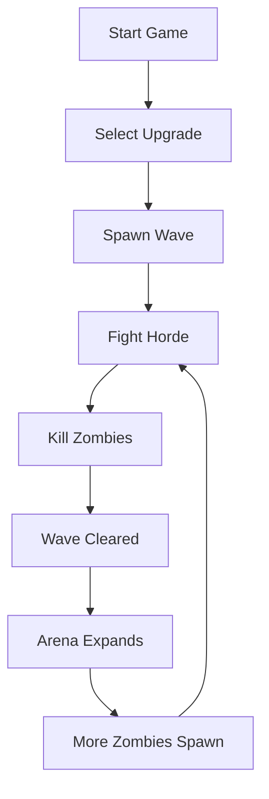

# 🧟‍♂️ ZOMBIE ARENA

### *When Humanity Fell, Survival Became a Skill.*

<p align="center">

# ⚔️ SURVIVE THE NIGHT

### Fight. Reload. Adapt. Repeat.

*A high-intensity 2D Zombie Survival Shooter built with C++ & SFML.*

</p>

---

## 🌑 THE APOCALYPSE HAS BEGUN

The world is gone.

Cities have fallen.

Civilizations have collapsed.

The only thing left standing between you and extinction is a loaded weapon and your instincts.

**Zombie Arena** is a fast-paced survival shooter where every second matters. Face relentless waves of infected creatures, battle increasingly dangerous hordes, and push your survival skills to the limit in an ever-expanding battlefield.

The longer you survive, the worse it gets.

The question isn't whether you'll die.

It's **how long you can survive.**

---

# 🎥 GAME PREVIEW

```text
╔══════════════════════════════════════╗
║             WAVE 12                 ║
║                                      ║
║   🧟      🧟‍♂️       🧟              ║
║                                      ║
║          🔫 PLAYER                  ║
║               ✚                     ║
║                                      ║
║    🧟‍♂️                🧟            ║
║                                      ║
╚══════════════════════════════════════╝
```

---

# 🚀 FEATURES

## 🎯 Precision Combat System

✔ Mouse-based aiming

✔ Real-time shooting mechanics

✔ Dynamic crosshair tracking

✔ Fast-paced action gameplay

✔ Responsive controls

✔ Bullet collision detection

---

## 🧟 Advanced Zombie Horde

The arena is populated with multiple zombie species:

### 🔴 CHASER

> Fast. Deadly. Relentless.

* Highest movement speed
* Low health
* Rushes players aggressively

---

### 🟢 CRAWLER

> Slow but persistent.

* Reduced speed
* Moderate health
* Overwhelms through numbers

---

### 🟡 BLOATER

> The tank of the apocalypse.

* Massive health pool
* Hard to eliminate
* Forces tactical play

---

# 🌎 PROCEDURAL BATTLEFIELD

Every wave transforms the battlefield.

### Dynamic Arena Scaling

```text
Wave 1  → Small Arena
Wave 5  → Larger Arena
Wave 10 → Massive Arena
Wave ∞  → Endless Survival
```

Features:

✅ Randomized terrain generation

✅ Dynamic tile rendering

✅ Expanding playable world

✅ Increasing difficulty curve

---

# ⚡ GAMEPLAY MECHANICS

### Movement

```text
W → Move Forward
A → Move Left
S → Move Backward
D → Move Right
```

### Combat

```text
Left Click → Shoot
Mouse Move → Aim
```

### System Controls

```text
ENTER → Pause / Resume
ESC → Quit Game
```

---

# 🧠 TECHNICAL HIGHLIGHTS

This project showcases:

### Object-Oriented Design

```cpp
Player
Zombie
Bullet
Arena
GameState
```

### Game Development Concepts

* Entity Management
* Collision Detection
* Dynamic Memory Allocation
* Real-Time Rendering
* Sprite Handling
* Camera Tracking
* Event Processing
* AI Path Following
* State Machine Architecture

---

# 🏗️ PROJECT STRUCTURE

```bash
ZombieArena
│
├── src
│   ├── Player.cpp
│   ├── Zombie.cpp
│   ├── Bullet.cpp
│   ├── Arena.cpp
│   └── Main.cpp
│
├── graphics
│   ├── background_sheet.png
│   ├── crosshair.png
│   ├── bloater.png
│   ├── crawler.png
│   ├── chaser.png
│   └── blood.png
│
├── fonts
│   └── zombiecontrol.ttf
│
└── README.md
```

---

# 🔥 GAME FLOW



---

# 📈 DIFFICULTY SYSTEM

Every completed wave increases:

* Zombie Count 📈
* Arena Size 📈
* Survival Complexity 📈
* Threat Level 📈

The game continuously scales to challenge the player.

No two survival runs feel the same.

---

# 🛠️ BUILT WITH

<p align="center">

C++ • SFML • OOP • Game Physics • Collision Detection • Real-Time Systems

</p>

---

# ⚙️ INSTALLATION

### Clone Repository

```bash
git clone https://github.com/yourusername/Zombie-Arena.git
cd Zombie-Arena
```

### Compile

```bash
g++ *.cpp -o ZombieArena \
-lsfml-graphics \
-lsfml-window \
-lsfml-system
```

### Run

```bash
./ZombieArena
```

---

# 🏆 WHAT I LEARNED

Building Zombie Arena helped me gain hands-on experience in:

* Advanced C++
* SFML Graphics Engine
* Game Architecture
* Real-Time Systems
* Memory Management
* AI Programming
* Interactive UI Systems
* Performance Optimization

---

# 🔮 FUTURE ROADMAP

### Planned Features

* 🔫 Multiple Weapons
* 💣 Grenades
* 🎵 Sound Effects
* 🎼 Background Music
* 👹 Boss Battles
* ❤️ Health Packs
* 💰 Currency System
* 🛒 Upgrade Shop
* 🌐 Multiplayer Mode
* 🏅 Global Leaderboards

---

# 👨‍💻 DEVELOPER

### Satyam Kumar

B.Tech Information Technology

Passionate about:

🤖 Artificial Intelligence
🎮 Game Development
🛡️ Cyber Security
📊 Machine Learning
🌐 Full Stack Development

---

<p align="center">

# 🧟 THEY KEEP COMING...

## HOW LONG CAN YOU SURVIVE?

⭐ Star this repository if you enjoyed the project.

</p>
